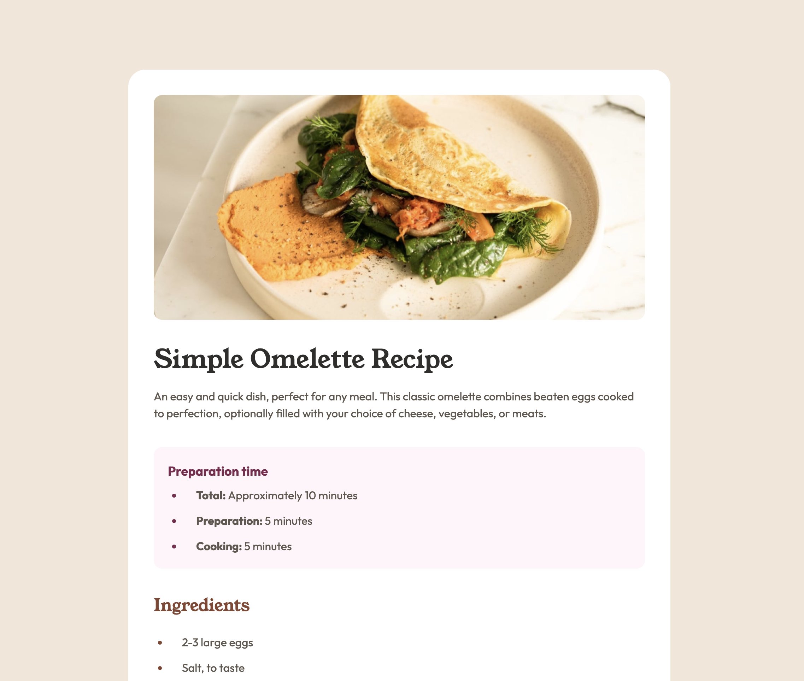

# Frontend Mentor - Recipe page solution

This is a solution to the [Recipe page challenge on Frontend Mentor](https://www.frontendmentor.io/challenges/recipe-page-KiTsR8QQKm). Frontend Mentor challenges help you improve your coding skills by building realistic projects.

## Table of contents

- [Overview](#overview)
  - [The challenge](#the-challenge)
  - [Screenshot](#screenshot)
  - [Links](#links)
- [My process](#my-process)
  - [Built with](#built-with)
  - [What I learned](#what-i-learned)
  - [Continued development](#continued-development)
  - [Useful resources](#useful-resources)

## Overview

### Screenshot

### Links

- Solution URL: [Code](https://github.com/yyuntzpan/recipe-page-solution)
- Live Site URL: [Recipe](https://recipe-page-solution-green.vercel.app/)

## My process

### Built with

- Semantic HTML5 markup
- CSS custom properties
- Flexbox
- Mobile-first workflow
- [Vue](https://reactjs.org/) - JS library
- [Vite](https://nextjs.org/) - Vue framework
- [Tailwind css](https://styled-components.com/) - For styles

### What I learned

I learned how to use Vue's `v-for`, which works similarly to React's `map`, to render `ref()` data. I also practiced using the `:class` binding syntax to implement conditional rendering. Additionally, I discovered and understood more Tailwind CSS shorthand utilities.

### Continued development

I am most proud of trying out the combination of Vite, Vue, and Tailwind CSS. I am more familiar with the Next.js, React, and module.css workflow. Next time, I might stick to the combination of Next.js, React, and module.css but integrate Tailwind CSS as well. This is because I spent too much time exploring new tools, and I think I should focus on mastering one setup first.

### Useful resources

- [Tailwindcss's Doc](https://tailwindcss.com/docs/installation) - This helped me for finding tailwind syntax.
